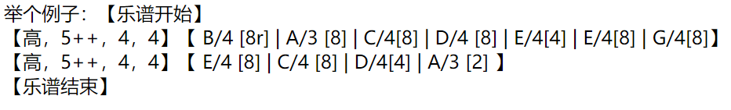
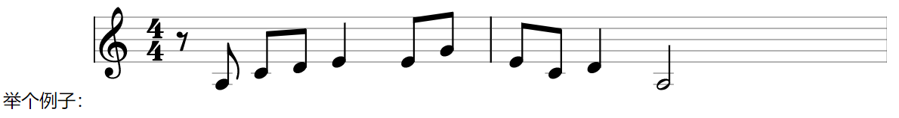

# YMusic
 
YMusic是一个用来在网页上显示和播放乐谱的javascript库。你可以用简洁的记号描述乐谱，YMusic自动把他们转换为svg形式的图片，而且可以播放。


举个例子：<br/>
<center></center><br/>
将被渲染成：
<center></center>

我做了一个可交互demo，可以玩一玩：[Play Ground](https://fftyyy.github.io/YMusic/)

## 使用

直接在html中引入：
```
<script src = "https://unpkg.com/ymusic@1.0.9/ymusic.js"></script>
```
就可以开始使用了。

### 启动YMusic渲染
使用命令
```
YMusic.start_ymusic(<config> , <tags>)
```
就可以在当前页面启动YMusic渲染。

这个函数接受两个参数，可以通过第一个参数`config`指定一些具体的配置选项（默认是`{}`，即使用默认配置），通过第二个参数`tags`指定在哪些html元素中渲染（默认是`["P"]`）。<br />

##### 示例
```
YMusic.start_ymusic(
	{
		width: 200,//每个小节的宽度
		speed: 1,  //播放速度（全音符的秒数）
	},
	["P" , "PRE"] //只在<p>和<pre>中渲染
)
```

### 初始化音频采样

如果初始化了音频样本，在渲染好乐谱后，单击渲染好的图片就可以播放这个谱子描述的音乐。这是一个可选的功能，要初始化音频采样，只需要调用：
```
YMusic.init_ymusic_sampler(<files> , <baseurl>)
```

其中第一个参数`files`指定音高和这个音对应的文件名，第二个参数`baseurl`指定存放音频文件的目录。音频必须是.mp3格式。

##### 示例
```
YMusic.init_ymusic_sampler(
	{
		A0: "A0.mp3" , 
		A1: "A1.mp3" , 
		A2: "A2.mp3" , 
		A3: "A3.mp3" , 
		A4: "A4.mp3" , 
		A5: "A5.mp3" , 
	} , 
	"https://tonejs.github.io/audio/salamander/",
)
```

这个函数只是采个音色，所有音高会根据采样的音高来自动计算，所以不需要采样所有音高的声音。理论上提供一个音就够了，但是离这个音太远的时候音色会失真，建议每个八度采一个样。

## 语法

调用了`YMusic.start_ymusic`之后，YMusic会查找网页上所有符合语法的片段，把他们渲染成乐谱图片。

这一节介绍如何向YMusic描述乐谱。

1. 首先，一个<strong>乐谱</strong>都要以`【乐谱开始】`开头，`【乐谱结束】`结尾，中间是对每个小节的描述。
2. 每个<strong>小节</strong>包含两个部分，『谱信息』部分和『音符信息』的部分，其中谱信息描述一些如调号、拍号等基本信息，『音符信息』描述小节内每个音符的信息。
3. <strong>谱信息</strong>这样描述：`【<谱号>，<线数>，<拍值>，<拍数>】`（注意逗号是中文逗号）。其中尖括号内的部分是需要明确的（不包含尖括号）。一个示例是：`【高，5，8，6】`表示高音、86拍的五线谱。
4. <strong>谱号</strong>目前有三种选择：`高`表示高音谱号，`低`表示低音谱号，`吉他`表示吉他谱。吉他谱的逻辑和五线谱略有不同
5. <strong>线数</strong>描述有多少条谱线。线数可以在后面写加减号，每个加号表示在下面添加一条隐藏的线，每个减号表示在上方添加一条隐藏的线。隐藏的线主要是用来放注释内容，比如和弦记号等的，也可以用这个方法来控制高度（渲染出的图片的高度不会自动调整，需要用这种方法手动调整）。注意加减号的顺序是无所谓的，比如`4+---+`表示四线谱，下方加两条线，上放加三条线。
6. <strong>拍值</strong>和<strong>拍号</strong>都是阿拉伯数字，没什么好说的。
7. 吉他谱可以在谱号后面打冒号来写每个弦的<strong>调弦</strong>，顺序是从一弦到四弦，这里的音高的升降号可以直接写在对应的音后面，不用打冒号写。举例：`【吉他：B/4、F#/4、D/4、A/3，4-，4，3】`，表示一个四线谱，一至四弦分别是B4、F#4、D4、A3，节奏是43拍。注意这个功能主要是在播放的时候有用，对渲染是没有影响的。
8. <strong>音符信息</strong>前后也有`【`和`】`符号，内部写每个音符的描述，各个音符的描述用竖线`|`隔开。为了方便排版，连续的竖线和所有空白都会被忽略。一个示例是：`【 | [4] A/4 | | [4] B/4 】`
9. 一个<strong>音符的描述</strong>由他的时值和各个音的音高组成，其中时值写在小方括号`[]`中，各个音高由中文顿号`、`隔开。
10. <strong>时值</strong>用一个数字描述，表示他是几分音符。比如`[4]`表示四分音符，`[8]`表示八分音符。时值中可以额外加一个`r`，表示这是一个休止符，比如`[4r]`表示这是一个四分休止符。注意休止符仍然需要给出音高。
11. 每个<strong>音</strong>的描述随不同的谱类型有所不同。<strong>五线谱的音</strong>用`<音名>/<数字>`，音名用大写英文字母表示，数字表示他处于哪个八度。一个示例是`C/4`表示中央C。<strong>吉他谱</strong>的音用`<弦数>-<品数>`给出，比如`1-3`表示一弦三品。注意品数这里也可以写非数字，比如`1-x`。
12. 每个音可以在后面打一个冒号`：`写<strong>临时升降号</strong>（不要在吉他谱上这么干....）。临时升降号目前提供了三种，升号`#`、降号`b`和换原号`n`。示例：`C/4：#`表示C#4这个音。
13. 有两种<strong>特殊音符</strong>：文字音符和和弦音符。文字音符用`文：<内容>`表示，在冒号后面可以写任意文字（建议不要写标点以免与关键字冲突）。和弦音符用`和：<和弦名>`表示。渲染的时候会在对应的音符旁边渲染给出的注释。这两种音符都可以在后面额外加一个冒号写位置`：<位置>`。
14. 文字音符和和弦音符这两种用于注释的音符的<strong>位置</strong>是这样表示的，以第一根（可见的）谱线的上方空白处为`0`号，以后每向上移动一个空白就-1，每向下移动一个空白就+1，可以是负数。注意所有注释都不会写在谱线上，只会写在空白上。举个例子，`和：G7：-1`表示在第一个谱线上方隔一个空白的位置注释和弦名为G7和弦。另外注意在吉他谱中也可以直接在品数栏写注释，效果是一样的。
15. <strong>连续写多个小节</strong>的时候，每个小节都要写谱信息，如果前后两个小节对应的谱信息一样（比如谱号一样），则在渲染时第二个小节会省略这个信息。
16. 在小节之间可以插入`换行`这两个字表示<strong>换行</strong>。换行后谱号拍号都会重新渲染。
17. 第一个小节开始前，可以写一个大括号`{}`，中间用标准的JSON语法来描述对这一段乐谱的特殊的<strong>配置</strong>。比如设置这一段播放的速度：`【乐谱开始】{"speed":1.5}【吉他,6,4,4】...`。可以设置的内容和`YMusic.start_ymusic`的参数`config`是一样的。

### 一个完整的实例

##### 五线谱
```
【乐谱开始】
	【高，5++-，4，4】【
		|        B/4 [8r]
		| 文：让、A/3 [8]
		| 文：我、C/4 [8] 
		| 文：们、D/4 [8] 
		| 文：荡、E/4 [4] | E/4 [8] 
		| 文：起、G/4 [8]
	】
	【高，5++-，4，4】【 
		| 文：双、E/4 [8] | C/4 [8] | D/4[4]  
		| 文：桨、A/3 [2]                           
	】
【乐谱结束】
```

##### 吉他谱
```
【乐谱开始】
	【吉他，6-，4，4】【
		|        7-  [8]
		| 文：让、4-2 [8]
		| 文：我、3-0 [8] 
		| 文：们、3-2 [8] 
		| 文：荡、2-0 [4] | 2-0 [8] 
		| 文：起、2-3 [8]
	】
	【吉他，6-，4，4】【 
		| 文：双、2-0 [8] | 3-0 [8] | 3-2 [4]  
		| 文：桨、4-2 [2]                           
	】
【乐谱结束】
```

渲染效果：
<center></center>

在/examples/index.html中可以看到完整的示例。

## 注释

Q：为什么升降号在谱子内要写在冒号后，而在描述调弦的时候可以直接写？

A：在谱子内的本质上是临时升降号，对后面同小节的所有音符都有效，不是音符内在的属性。

---
Q：为什么休止符需要有音高？

A：为了说明把休止符放到什么位置。

---
Q：既然可以把文字写在品数的位置，为什么还需要注释音符？

A：因为五线谱没法这么干。

---

Q：为什么要用中文标点？

A：英文标点太小了不好看。

--- 

Q：能用中音谱号吗？

A：不能

--- 

Q：能写附点音符吗？

A：现在还没有这功能，以后有空会（摸）加（了）。

---

Q：能写调号吗？

A：现在还没有这功能，以后有空会（摸）加（了）。

---

Q：推弦/扫弦/琶音/颤音/闷音/制音/滑音/击勾弦...记号？

A：都没有

---

Q：能同时播放多个乐谱吗（比如，一个高音部分和一个低音部分）？

A：现在还没有这功能，以后有空会（摸）加（了）。
